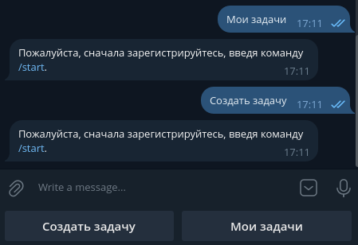

# Tasks Bot

## Содержание
- [Задача](#задача)
- [Описание](#описание)
- [Требования](#требования)
  - [1. Функциональность Telegram-бота](#1-функциональность-telegram-бота)
    - [a. Регистрация новых пользователей](#a-регистрация-новых-пользователей)
    - [b. Создание задач](#b-создание-задач)
    - [c. Просмотр и управление задачами](#c-просмотр-и-управление-задачами)
    - [d. Использование постоянных и inline меню](#d-использование-постоянных-и-inline-меню)
    - [e. Выполнение SQL-запросов](#e-выполнение-sql-запросов)
  - [2. Контейнеризация с использованием Docker](#2-контейнеризация-с-использованием-docker)
  - [3. Репозиторий на GitHub](#3-репозиторий-на-github)
- [Обзор выбранных технологий и инструментов](#обзор-выбранных-технологий-и-инструментов)
  - [1. PostgreSQL](#1-postgresql)
  - [2. SQLAlchemy](#2-sqlalchemy)
  - [3. Pyrogram](#3-pyrogram)
  - [4. Transitions](#4-transitions)
  - [5. Makefile](#5-makefile)
  - [6. Docker](#6-docker)
  - [7. Pipenv](#7-pipenv)
- [Описание основных классов и функций, их назначения и взаимодействия](#описание-основных-классов-и-функций-их-назначения-и-взаимодействия)
  - [1. Конечный Автомат](#1-конечный-автомат)
  - [2. Сервисы для взаимодействия с Базой Данных](#2-сервисы-для-взаймодействия-с-базой-данных)
  - [3. Сервисы с бизнес-логикой](#3-сервисы-с-бизнес-логикой)
- [Описание использованных SQL-запросов и структуры Базы Данных](#описание-использованных-sql-запросов-и-структуры-базы-данных)
  - [1. Структура Базы Данных и ее создание](#1-структура-базы-данных-и-ее-создание)
  - [2. Использованные SQL-запросы](#2-использованные-sql-запросы)
- [Примеры использования бота](#примеры-использования-бота)
- [Технические условия для локального запуска приложения](#технические-условия-для-локального-запуска-приложения)
  - [Протестировано с версиями](#протестировано-с-версиями)
- [Запуск приложения](#запуск-приложения)
  - [Запуск с использованием Makefile](#запуск-с-использованием-makefile)
  - [Запуск без использования Makefile](#запуск-без-использования-makefile)
- [Примечания](#примечания)

## Задача

Ваша задача состоит в разработке Telegram-бота с использованием библиотеки Pyrogram. Бот должен иметь функциональность работы с Finite State Machine (FSM), использовать постоянные и inline меню, а также взаимодействовать с базой данных.

## Описание

Вы разрабатываете бота для управления задачами. Пользователи должны регистрироваться в системе и иметь возможность создавать, просматривать и управлять своими задачами. Бот должен сохранять информацию о задачах в базе данных и предоставлять пользователю удобный интерфейс для работы с ними.

## Требования

### 1. Функциональность Telegram-бота

#### a. Регистрация новых пользователей
- **Регистрация при первом входе:**
  - При первом взаимодействии с ботом пользователю необходимо предоставить возможность зарегистрироваться в системе, введя свое имя и выбрав уникальный логин.
  - Информация о зарегистрированных пользователях должна сохраняться в базе данных.

#### b. Создание задач
- **Создание задач зарегистрированными пользователями:**
  - Зарегистрированный пользователь должен иметь возможность создавать новые задачи, указывая их название и описание.
  - Информация о задачах должна сохраняться в базе данных и быть связана с соответствующим пользователем.

#### c. Просмотр и управление задачами
- **Список задач:**
  - Пользователь должен иметь возможность просматривать список своих задач.
  - Бот должен предоставлять интерфейс для управления задачами, например, возможность пометить задачу как выполненную или удалить задачу.

#### d. Использование постоянных и inline меню
- **Постоянные меню:**
  - Бот должен использовать постоянные меню для навигации по функциональностям.
- **Inline меню:**
  - Бот должен использовать inline меню для взаимодействия с конкретными задачами.

#### e. Выполнение SQL-запросов
- **Выполнение SQL-запросов к базе данных:**
  - Бот должен уметь выполнять SQL-запросы к базе данных.
  - Результаты запросов должны быть корректно обработаны и представлены пользователю.

### 2. Контейнеризация с использованием Docker
- **Упаковка приложения в Docker-контейнер:**
  - Приложение должно быть упаковано в Docker-контейнер.
  - Подготовьте Dockerfile для сборки контейнера.
  - Убедитесь, что ваше приложение работает корректно внутри контейнера.

### 3. Репозиторий на GitHub
- **Фиксация изменений:**
  - Зафиксируйте все изменения в вашем репозитории на GitHub.

## Обзор выбранных технологий и инструментов

### 1. PostgreSQL
Выбор PostgreSQL был обусловлен его надежностью, высокой производительностью и популярностью, что делает его отличным выбором для хранения данных пользователей и задач.

### 2. SQLAlchemy
SQLAlchemy была выбрана в качестве инструмента для работы с базой данных. Она предоставляет мощный, гибкий и асинхронный способ взаймодействия с базой данных. Это значительно упрощает работу с базой данных, уменьшает задержку между запросами и ответами приложения и улучшает читаемость кода.

### 3. Pyrogram
Pyrogram - это современная асинхронная библиотека для работы с Telegram API. Она была выбрана за свою простоту, высокую производительность и активное сообщество. Pyrogram позволяет легко интегрировать Telegram-бота с приложением на Python и обеспечивает удобный интерфейс для взаимодействия с API Telegram.

### 4. Transitions
Transitions - это библиотека для реализации конечных автоматов (FSM). Она была выбрана для управления состояниями бота, что позволяет легко определять и контролировать различные состояния и переходы между ними. Использование FSM улучшает структуру и поддержку кода, делая его более модульным и организованным.

### 5. Makefile
Makefile используется для автоматизации задач в процессе разработки. Он позволяет легко управлять различными командами и скриптами, необходимыми для сборки, тестирования и развертывания приложения.

### 6. Docker
Docker обеспечивает контейнеризацию приложения, что позволяет создать изолированную среду для его выполнения. Контейнеризация упрощает развертывание приложения, а также улучшает его безопасность и управляемость.

### 7. Pipenv
Pipenv используется для управления зависимостями Python и виртуальными окружениями. Он предоставляет простой и удобный способ установки и обновления зависимостей, а также управления версиями пакетов.

## Описание основных классов и функций, их назначения и взаимодействия

Задание реализовано по принципам `Чистой Архитектуры` (насколько это возможно при текущих требованиях), `Onion Architecture`, если быть точным.

Вся кодовая база находится в папке `tasks_bot/core/`.

### 1. Конечный Автомат
Конечный Автомат (FSM) реализован с помощью библиотеки `transitions`. Все классы и функции, относящиеся к FSM находятся в директории `tasks_bot/core/fsm`

В файле `state_machine.py` реализован, который хранит в себе состояния, переходы и модели, а так же некоторые переменные, кототыре используется в ходе выполнения программы.

В файл `states.py` реализован enum, которые хранит в себе все возможные состояния.

В файле `tranisitions.py` реализон enum, который хранит в себе все возможные переходы и триггеры.

### 2. Сервисы для взаимодействия с Базой Данных

Сервисы для взаймодействия с Базой Данных (БД) - это сервисы, которые являются промежуточными звеньями для взаимодействия с БД. Они нужны для того, чтобы разделить уровень представления, бизнес-логику и БД. Эти сервисы находятся в `tasks_bot/core/adapters/repositories/`.

В файле `base_repository.py` реализован общий класс (с общими методами) для взаимодействия с БД.

В файле `user_repository.py` находится класс, который реализует в себе методы взаимодействия с таблицей `task` в БД.

В файле `task_repository.py` находится класс, который реализует в себе методы взаимодейстия с таблицей `user` в БД.

### 3. Сервисы с бизнес-логикой

Сервисы, находящиеся в `tasks_bot/core/usecases/`, реализуют всю бизнес-логику приложения.

В файле `state_management.py` реализована команда `/start` и управление состояниями бота.

В файле `user_management.py` реализованы все методы для взаимодействия с пользователем.

В файле `task_management.py` реализованы все методы для взаимодействиями с задачами.

## Описание использованных SQL-запросов и структуры Базы Данных

### 1. Структура Базы Данных и ее создание

БД состоит из двух таблицы: `user` и `task`. Эти таблицы создаются следующими запросами:

```sql
CREATE TABLE IF NOT EXISTS "user" (
    id SERIAL PRIMARY KEY,
    user_id INTEGER UNIQUE,
    username VARCHAR NOT NULL UNIQUE,
    name VARCHAR NOT NULL
);

CREATE TABLE IF NOT EXISTS "task" (
    id SERIAL PRIMARY KEY,
    title VARCHAR NOT NULL,
    description VARCHAR(256),
    is_completed BOOLEAN DEFAULT FALSE,
    owner_id INTEGER REFERENCES "user"(id) ON DELETE CASCADE
);
```

### 2. Использованные SQL-запросы

> **_Примечание: ниже будут отображены не все SQL-запросы_**

Создание пользователя:
```sql
INSERT INTO "user" (user_id, username, name)
VALUES (:user_id, :username, :name)
```

Создание задачи:
```sql
INSERT INTO "task" (title, description, owner_id)
VALUES (:task_title, :task_desc, (SELECT id FROM "user" WHERE user_id = :user_id))
```

Обновление задачи:
```sql
UPDATE "task"
SET is_completed = TRUE
WHERE id = :task_id
```

Получение всех задач пользователя:
```sql
SELECT id, title, description, is_completed
FROM "task"
WHERE owner_id = (SELECT id FROM "user" WHERE user_id = :user_id)
```

## Примеры использования бота

Для начала работы с ботом нужно ввести команду `/start`. Бот поприветствует Вас и предложит ввести Ваше имя


После этого, бот предложит ввести вам логин


Если логин занят, бот предложит ввести его заново


Если логин уникальный, регистрация завершается и снизу чата появляется несколько кнопок для взаимодействия с задачами:


Для просмотра своих задач нужно нажать на соотвествующую кнопку


Чтобы создать задачу, нажмите кнопку `Создать задачу`. Бот предложит ввести вам название и описание задачи:


Теперь задача отображется в `Мои задачи`


Чтобы пометить задачу как выполненную, нажмите соответствующую кнопку


После этого задачу можно удалить


### Дополнительный примеры

Если пользователь не завершит действие и попытается начать новое, бот попросит пользоватетля завершить начатое действие:


Если незарегистрированный пользователя захочет создать задачу или просмотреть свои задачи, бот попросил его зарегистрироваться:


## Технические условия для локального запуска приложения
* Python 3.11.x
* Pipenv
* Docker
* Docker compose
* Make

#### Протестировано с версиями:

* Python — 3.11.2
* Pipenv — 2023.3.20
* Docker — 25.0.4
* Docker compose — 2.24.7
* OS — Ubuntu 22.04
* Make — 4.3

## Запуск приложения

1. Запустите консоль и перейдите в корень проекта
```shell
cd tasks-bot
```

2. Создайте файл `.env` и заполните его по примеру `.env.sample`.

### Запуск с использованием Makefile

Для запуска бота с использованием Makefile просто введите в консоли:
```shell
make start-bot
```

### Запуск без использования Makefile

Для запуска без Makefile введите следующие команды:
```shell
docker compose -f ./build/docker-compose/docker-compose.yml up --build
```

После этого перейдите в диалог с ботом и напишите `/start`.

## Примечания

> **Данное приложение является исключительно тестовым продуктом, направленный на демонстрацию навыков и знаний. В этом решение <ins>сознательно</ins> не имлементированы такие вещи, как:**
> 
> **1. Более надежное хранилище состояний, например, _Redis_ или _MongoDB_.**
> 
> **2. Отсутствие какого-либо тестирования (юнит и интеграционного).**
> 
> **3. Использование сырых SQL-запросов вместо применения ORM.**